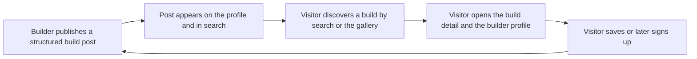

## Ringkasan (Bahasa Indonesia)

Vin adalah wadah terfokus bagi para builder Gunpla di Indonesia untuk membagikan build dan menemukan karya orang lain berdasarkan kit, grade, gaya, dan teknik. Dokumen ini menjelaskan masalah yang ingin dijawab, alasan Vin ada, audiens awal, ruang lingkup MVP dengan empat kemampuan inti (profil builder, build post terstruktur, pencarian dan filter, serta halaman detail build), aturan label dan peringatan bootleg / knock-off, user story beserta kriteria penerimaan, non-goal eksplisit, sinyal keberhasilan tanpa angka rekaan, dan pertanyaan terbuka.

Dokumen ini merujuk ke [`vin-product-overview.md`](../vin-product-overview.md) sebagai sumber kebenaran. Jika ada perbedaan, overview yang menang. Dokumen ini hanya menambahkan keputusan pada tingkat pengembangan jika hal itu ditandai dengan jelas. Fitur di luar MVP ditandai sebagai usulan masa depan dan tidak disajikan sebagai fitur yang sudah tersedia.

---

# Vin Product Requirements Document (PRD)

Status: Development document.
Source of truth: [`vin-product-overview.md`](../vin-product-overview.md).
Scope: The first release (MVP) of Vin.

This document translates the confirmed product direction in the overview into requirements that can be built and verified. It does not expand the MVP. Where this document records something the overview does not, it is labeled as a development-level decision or left as an open question.

## 1. Product summary

Vin is a focused, searchable Gunpla showcase. Builders publish structured build posts. Visitors find builds and builders by kit, grade, style, and technique. The homepage is gallery-first. Visitors can browse without an account; an account is required to publish or save a build.

Confirmed scope from the overview:

- Launch market: Indonesia first, with room to expand later.
- Initial focus: Gunpla. The data model must be able to extend to other model-kit types, grades, styles, and techniques later.
- Core loop: sharing builds and discovering builds, starting together.
- MVP shape: a searchable showcase, not a marketplace or a full encyclopedia.

The current app homepage is still the generated starter page. The gallery-first experience is approved product direction, not an implemented feature.

## 2. Problem and why Vin exists

The overview records friction in the Gunpla hobby. The first release addresses the discovery and sharing problems directly. It will not solve every part of the hobby in one launch.

| Problem | What Vin does about it in the MVP |
| --- | --- |
| Social posts are hard to find when creators do not use consistent tags, and plain-text search makes a specific style or technique hard to locate. | Structured build posts store kit, grade, style, and technique as structured values, so posts can be filtered reliably. |
| A person who likes an unfamiliar model may not know its name, grade, or source series. | Build detail pages show the structured kit fields that are known, giving visitors a starting point. |
| Finding a builder whose work matches a desired style can require repeated searching and direct messages. | Builder profiles gather a builder's published work in one place, reachable from every build post. |
| Build information, creator portfolios, kit references, shopping, and community discussion are spread across different services. | Vin focuses on builds, kits, and builders first, without trying to own shopping or discussion in the MVP. |

Why the loop starts together (from the overview): search needs useful posts with consistent details, and builders need a reason to post and a place where their work can be found. Starting with both creates a small loop that Vin can learn from before adding transaction-heavy features.

## 3. Target audience

Vin starts with Gunpla hobbyists in Indonesia. The initial audience includes:

- Builders who want to document their work.
- People looking for builds by kit or style.
- Builders who want a profile that gathers their work in one place.

Indonesia-first is a confirmed launch choice. Language support, launch communities, moderation approach, and local operating needs are still open questions (see section 8). This document does not claim market size, demand, or growth. Research notes about Indonesian social groups and local buying context are unverified leads and are not treated as market facts.

## 4. MVP scope

### 4.1 Core capabilities

1. **Builder profiles** gather a builder's identity and published build posts. The exact profile fields are still open.
2. **Structured build posts** pair photos and a description with searchable information about the build.
3. **Search and filters** help visitors find posts by text and selected structured fields.
4. **Build viewing** gives each post a stable page that can be shared and opened from search results or a builder profile.

### 4.2 The share + discover loop

The MVP must make both halves work. Publishing without discovery gives builders no reason to keep posting. Discovery without published posts gives visitors nothing to find. The two ship together.

### 4.3 Gallery-first homepage

The homepage shows Vin through the activity it supports rather than a long pitch. Required elements, in order:

1. A concise introduction that Vin helps people in Indonesia find Gunpla builds and builders.
2. Search and a small set of filters.
3. A gallery of real build posts, with paths to each build and its creator profile.

The full product story lives on a separate About page, not on the homepage.

Content rule: the gallery needs real builds that creators have agreed to share. If there is not enough content for a useful gallery at launch, Vin uses a temporary introduction page that invites builders to contribute. The gallery is never filled with invented or unapproved work.

### 4.4 Browse without an account

- Visitors can browse the gallery, open build detail pages, open builder profiles, and use search without signing in.
- An account is required to publish or save a build.
- Social posts can link directly to a build or profile so visitors arrive at the work they were interested in.

### 4.5 Bootleg / knock-off label and warning policy

This policy follows the overview directly.

- Bootleg / knock-off builds are allowed to be shared.
- When a user selects the bootleg / knock-off product status, Vin shows a warning that the item is counterfeit.
- The warning states that Vin does not endorse counterfeit goods.
- The user may acknowledge the warning and continue, or change the selection.
- The published post carries a clear bootleg / knock-off label.
- Sharing a post about a bootleg build does not automatically permit selling counterfeit goods.
- Selling rules are a separate, deferred decision. The MVP does not include selling.

Open related question: whether bootleg / knock-off posts should receive reduced visibility in future recommendation surfaces. This is not decided, and the MVP has no recommendation surface. See section 8.

### 4.6 First taxonomy (candidates, not final)

The field list below comes from the overview and is a candidate first taxonomy, not a final schema. A small initial set is preferable to a long list that builders cannot apply consistently.

| Field | Purpose |
| --- | --- |
| Base kit | Which kit the build started from |
| Grade | A Gunpla grade, when known |
| Scale | The model scale, when known |
| Series | The source series, when known |
| Build type | For example, straight build or custom build |
| Style | A visual description, such as weathered or clean |
| Techniques | Methods used, such as airbrushing or scribing |
| Product status | Distinguish official products, third-party products, and bootleg / knock-off products |
| Photos and description | Show the result and provide context |

The exact fields, required versus optional, and controlled values are agreed in Phase 0 of the roadmap and recorded in the ERD. Raw hashtags are not the primary taxonomy; categories are structured data.

### 4.7 Explicit non-goals

The first release does not include:

- A complete marketplace or checkout.
- Commission requests, payments, escrow, or order management.
- Image recognition or automatic kit identification.
- Collection tracking or workshop inventory.
- A full model-kit encyclopedia, supply store, or all-hobby social network.

Some of these may be considered later. None is available until designed and built, and no roadmap phase promises them.

## 5. User stories and acceptance criteria

Terminology used consistently: build post, builder profile, kit, grade, scale, series, style, technique, product status, bootleg / knock-off, taxonomy.

### US-1 Share a build

As a signed-in builder, I want to publish a build post with photos, a description, and structured tags, so that other people can find my work.

Acceptance criteria:

- [ ] An unauthenticated visitor who tries to publish is prompted to sign in or create an account, and is not able to publish.
- [ ] A signed-in user can create a build post with one or more photos and a description.
- [ ] The post supports selecting values from the first taxonomy, including base kit, grade, build type, style, techniques, and product status.
- [ ] Selecting the bootleg / knock-off product status triggers the counterfeit warning before publishing (see US-5).
- [ ] On publish, the post receives a stable, shareable URL.
- [ ] The published post appears on the builder profile and is eligible to appear in search results where it matches.
- [ ] Missing required fields and invalid input produce inline validation errors.
- [ ] A user who is not the owner cannot edit or delete the post.

### US-2 Find a build by text and filters

As a visitor, I want to search by text and apply filters, so that I can find builds matching a kit, style, or technique.

Acceptance criteria:

- [ ] A visitor can search without an account.
- [ ] Text search matches the build description and the structured values.
- [ ] Filters allow narrowing by the structured fields available in the first taxonomy, for example grade, style, technique, and product status.
- [ ] Query and filters can be combined.
- [ ] The active query and filters are reflected in the URL so results can be shared and reopened.
- [ ] Empty results show a clear empty state and a way to clear the filters.
- [ ] Loading and error states are handled (see Phase 6 of the roadmap).

### US-3 View a build

As a visitor, I want to open a build post to see its photos, description, and structured details.

Acceptance criteria:

- [ ] Each published build has a stable detail page.
- [ ] The page is reachable from search results, the homepage gallery, and the builder profile.
- [ ] The page shows all published photos, the description, and the structured fields that were provided.
- [ ] When the product status is bootleg / knock-off, the page shows the bootleg / knock-off label.
- [ ] The page links to the builder profile.
- [ ] The page exposes metadata suitable for sharing and indexing.
- [ ] A signed-in user can save the build; a visitor is prompted to sign in to save.
- [ ] A removed or unpublished build does not appear and does not leave a broken link where avoidable.

### US-4 View a builder profile

As a visitor, I want to view a builder profile to see their identity and published builds.

Acceptance criteria:

- [ ] Each builder has a public profile page.
- [ ] The profile lists the builder's published build posts.
- [ ] From the profile, a visitor can open any listed build.
- [ ] The profile is reachable from any build post by that builder.
- [ ] The profile shows identity fields for the builder (display name, avatar, and short bio; exact fields are open).
- [ ] Only published builds are listed. Private or removed posts are not shown.
- [ ] The profile does not display invented or unapproved content.

### US-5 Receive the bootleg warning

As a user selecting the bootleg / knock-off product status, I want a clear warning before publishing, so that I understand the item is counterfeit and that Vin does not endorse it.

Acceptance criteria:

- [ ] Selecting the bootleg / knock-off product status shows a warning that the item is counterfeit.
- [ ] The warning states that Vin does not endorse counterfeit goods.
- [ ] The user can acknowledge the warning and continue, or change the product status selection.
- [ ] The published post carries a visible bootleg / knock-off label.
- [ ] The label is visible on the build detail page and in result listings.
- [ ] The policy does not imply that selling counterfeit goods is permitted.

## 6. Success signals

These are signals Vin should watch. They are hypotheses, not commitments, and this document sets no numeric targets. Any future target must come from real measured data, marked with `[REAL DATA]` once available.

| Signal | Why it matters |
| --- | --- |
| Builders publish structured posts without being prompted. | Organic contribution shows the post format is worth the effort. |
| Visitors complete a search and open a build detail page. | Discovery is working end to end. |
| Visitors reach a builder profile from a build. | The loop connects builds to builders. |
| Some visitors return to browse again. | The gallery has ongoing value beyond a first visit. |
| Published posts carry consistent structured tags. | Tag coverage shows the taxonomy is usable and search will stay reliable. |
| Accounts are created from a build or profile. | Sign-ups follow discovery rather than a forced gate. |
| Qualitative feedback says search finds relevant work. | Structured search is solving the original problem. |

Cold start remains a risk: a gallery needs enough real builds to be useful. The planned response is the temporary introduction page and outreach to launch communities, not fabricated content.

## 7. Development-level decisions

These extend the overview and are recorded for implementation. They are not product promises.

- Repository: Bun-managed Turborepo monorepo with `apps/*` and `packages/*`.
- Web app: `apps/web`, Next.js with the App Router, React 19, TypeScript.
- Backend for the MVP: Supabase (managed Postgres, Auth, Storage), chosen for launch speed.
- Portability guardrails: the Drizzle ORM schema is the single source of truth for the database. Supabase Auth and Storage calls are isolated behind small adapter modules so a later move to self-hosted Supabase or plain Postgres is bounded work.
- Auth methods: email/password plus Google sign-in.
- Search progression: start with database search and structured filters. Add a dedicated search service (Meilisearch recommended, Typesense a close alternative) only when real usage justifies it. This does not require replacing Next.js.
- Documentation language: bilingual. Each document opens with a Bahasa Indonesia summary, followed by the full English content.

## 8. Open questions

The following are unresolved. They are not decisions and must not be built as if settled.

| Topic | Open question | Note |
| --- | --- | --- |
| Home recommendation algorithm | Should the homepage recommend anything beyond the gallery? | A proposal exists but is not approved: keep search results focused; keep the homepage broad; if personalization is added, show it as a small, clearly labeled "related to your recent search" section; treat one search as a temporary signal, not a stored preference. |
| Taxonomy data ownership | Will builders enter kit details, or does Vin need a maintained catalog? Who defines and updates categories? | The MVP starts small and grows. No exhaustive catalog is required. |
| Launch communities | Which communities should Vin approach first? | Indonesia-first is confirmed; the specific communities are not. |
| Language support | Which language or languages should the first release support? | Indonesia-first does not by itself decide the interface language or languages. |
| Moderation operations | How are reports, removals, and disputes handled at launch? | The moderation policy document is separate. |
| Design / brand direction | What are the final color and type choices? | Not defined. This blocks final visual tokens in the design system. |
| Bootleg visibility | Should bootleg / knock-off posts receive reduced visibility in recommendation surfaces if Vin adds them later? | The MVP has no recommendation surface. Sharing is allowed with a label and warning. |
| Expansion evidence | What evidence from the showcase would justify identification, collection, commissions, or commerce? | These remain future directions, not features. |

## 9. Traceability to the product overview

| PRD section | Overview source |
| --- | --- |
| 1. Product summary | Product direction, Confirmed choices |
| 2. Problem and why Vin exists | Why Vin should exist; Why sharing and search start together |
| 3. Target audience | Audience and launch |
| 4.1 Core capabilities | MVP: a searchable Gunpla showcase, Core capabilities |
| 4.2 Share + discover loop | Why sharing and search start together |
| 4.3 Gallery-first homepage | First-visit homepage |
| 4.4 Browse without an account | First-visit homepage |
| 4.5 Bootleg / knock-off policy | Confirmed choices; Bootleg visibility and sales |
| 4.6 First taxonomy | MVP field table; Taxonomy that can grow |
| 4.7 Non-goals | Explicitly out of the MVP |
| 6. Success signals | Why sharing and search start together; Risks and open questions |
| 7. Development-level decisions | Current implementation and framework; context bundle confirmed development-level decisions |
| 8. Open questions | Risks and open questions |

## 10. Related documents

- [`07-roadmap.md`](07-roadmap.md) for the milestone plan and launch checklist.
- [`vin-product-overview.md`](../vin-product-overview.md) for the product source of truth.
