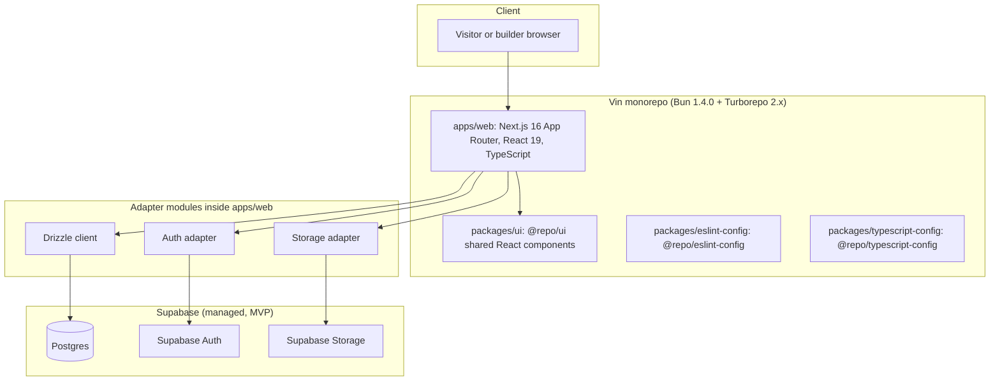
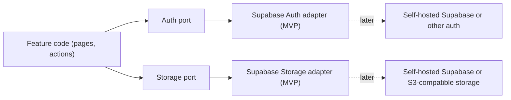

# 02 Architecture

## Ringkasan (Bahasa Indonesia)

Dokumen ini menjelaskan arsitektur teknis Vin untuk MVP. Vin adalah monorepo Turborepo yang dikelola Bun, dengan aplikasi web Next.js (App Router) di `apps/web` dan paket bersama di `packages/*`. Backend MVP memakai Supabase (Postgres terkelola, Auth, Storage) demi kecepatan peluncuran. Drizzle ORM menjadi satu-satunya sumber kebenaran skema database. Panggilan Supabase Auth dan Storage diisolasi di modul adapter agar perpindahan ke Supabase self-hosted atau Postgres biasa tetap terbatas. Pencarian dimulai dari pencarian database dan filter terstruktur, lalu layanan pencarian khusus (Meilisearch, alternatif Typesense) ditambahkan hanya saat penggunaan nyata menuntut. Workspace `apps/docs` bawaan starter sudah dihapus; dokumentasi kini berupa Markdown di folder `documents/`.

## Purpose

This document records the technical architecture for the Vin MVP. It separates what is confirmed today from what is proposed for later, so implementation can proceed without inventing decisions.

Source of truth: `documents/vin-product-overview.md`. Where this document adds a decision that is not in the overview, it is labeled as a development-level decision or an open question.

## Current repository layout (confirmed)

Vin is a Bun-managed Turborepo monorepo. The layout below is confirmed from the repository, not proposed.

| Path | Role | Status |
| --- | --- | --- |
| `apps/web` | Next.js App Router web application | Confirmed |
| `packages/ui` | Shared React component library (`@repo/ui`) | Confirmed |
| `packages/eslint-config` | Shared ESLint config (`@repo/eslint-config`) | Confirmed |
| `packages/typescript-config` | Shared TypeScript config (`@repo/typescript-config`) | Confirmed |
| `apps/docs` | Removed from the Turborepo starter | Removed |
| `documents/` | Markdown documentation, including `documents/development/` | Confirmed |

The Turborepo starter's separate `apps/docs` workspace was removed. Documentation is now Markdown under the root `documents/` folder. This keeps documentation in the repository without a second deployable app.

## Runtime and tooling (confirmed)

- Package manager: Bun 1.4.0, declared in the root `package.json` under `devEngines.packageManager` and in `apps/web/package.json` under `packageManager`.
- Task runner: Turborepo `^2.11.5`. Root scripts are `build`, `dev`, `lint`, `format`, and `check-types`.
- Node engine: `>=24`.
- Turborepo tasks: `build` depends on `^build` and declares `.env*` as inputs and `.next/**` as outputs; `lint` and `check-types` depend on their upstream tasks; `dev` is persistent and uncached.
- TypeScript: `7.0.2` at the root and in `packages/ui`; `apps/web` uses `^5`.
- Formatting: Prettier `3.9.6` at the root.

## Web application: apps/web (confirmed)

- Framework: Next.js `16.3.7` with the App Router.
- UI runtime: React `19.2.8` and React DOM `19.2.8`.
- Styling: Tailwind CSS `^4` with `@tailwindcss/postcss`.
- Lint: ESLint `9` with `eslint-config-next` `16.3.7`.
- App Router entry points exist at `apps/web/app/layout.tsx` and `apps/web/app/page.tsx`. The current homepage is still the generated starter page, so the gallery-first experience is approved product direction, not an implemented feature.

The MVP needs public build and profile pages, search and filter state, and page metadata for sharing and indexing. Next.js App Router covers routing, metadata, sitemaps, and local workspace package transpilation. No concrete mismatch with the MVP has surfaced, so there is no current reason to replace it.

## Backend for MVP: Supabase (confirmed)

Supabase provides managed Postgres, Auth, and Storage for the MVP. It was chosen for launch speed. The MVP uses:

- Postgres as the primary database.
- Supabase Auth for email/password and Google sign-in.
- Supabase Storage for build photos.

Portability guardrails apply:

- Keep the Postgres schema standard. Avoid vendor-specific database features that would block a move to plain Postgres.
- Isolate Supabase Auth and Storage calls behind small adapter modules.
- Treat Drizzle ORM as the single source of truth for the schema.

## Data access: Drizzle ORM as source of truth (confirmed)

Drizzle ORM defines the database schema. Migrations are generated from the Drizzle schema and applied to Postgres. Application code reads and writes through the Drizzle client.

Why this matters: the schema stays portable and reviewable in TypeScript, and the database is not defined by Supabase-specific tooling. A later move to self-hosted Supabase or plain Postgres changes connection and migration wiring, not the schema definition.

The exact Drizzle package versions, migration workflow, and connection setup are implemented and recorded in [ADR-008](decisions/ADR-008-supabase-drizzle-wiring.md): Drizzle ORM 0.45.3 with the postgres.js driver, schema in `apps/web/db/schema.ts`, reviewable SQL migrations applied with `drizzle-kit migrate`, and `DATABASE_URL` pointing at the Supabase Session pooler.

## Adapter pattern for portability (confirmed)

Supabase Auth and Storage are accessed only through adapter modules. Application code depends on the adapter interface, not on the Supabase SDK directly.

Adapter responsibilities:

- Auth adapter: sign up, sign in, sign out, session lookup, and current user lookup. It returns app-level user data, not Supabase-specific objects.
- Storage adapter: upload, delete, and resolve a public URL for a build photo. It returns a storage path and URL, not a Supabase-specific object.

Why this matters: a later move to self-hosted Supabase or plain Postgres becomes bounded work. Only the adapter implementations change. Feature code stays the same.

The auth adapter interface (`AuthPort`) is implemented in `apps/web/lib/auth/` and recorded in [ADR-008](decisions/ADR-008-supabase-drizzle-wiring.md). The storage adapter interface is still to be finalized during the photo upload increment.

## Image storage for build photos (confirmed approach)

Build photos are stored in Supabase Storage for the MVP. The database stores a storage path and metadata, not the image bytes.

- Upload path convention: one folder per build, for example `builds/{build_id}/{photo_id}.{ext}`. The exact convention is an implementation detail.
- The `build_photos` table stores the storage path, optional alt text, optional dimensions, and a sort order. See `03-erd.md`.
- Public read access for published build photos is the MVP default. Upload and delete require an authenticated owner.
- Image optimization and responsive delivery are handled at the web layer. Next.js image handling is the likely path, but the exact approach is not yet implemented.

Why this matters: keeping image bytes out of Postgres keeps the database small and lets storage move independently. The storage adapter isolates the provider.

## Search progression (confirmed direction)

Search starts simple and grows only when real usage justifies it.

| Stage | Approach | When |
| --- | --- | --- |
| MVP | Database search plus structured filters | Launch |
| Later | Dedicated search service, Meilisearch recommended | When usage justifies it |
| Alternative | Typesense as a close alternative to Meilisearch | If Meilisearch does not fit |

MVP search behavior:

- Text search over build titles and descriptions using Postgres.
- Structured filters over taxonomy fields: kit, series, grade, style, technique, and product status.
- Results ordered by recency by default.

Later search behavior:

- A dedicated search service adds typo tolerance, ranking control, and faster faceted filters.
- Meilisearch is the recommended option. Typesense is a close alternative.
- Adding a search service does not require replacing Next.js. The web app keeps its routes and calls the search service through a server-side module.

Why this matters: a search service is an operational cost. The MVP should prove that people search and filter before Vin takes on that cost.

## Environments and configuration (confirmed for local development)

The MVP needs at least two environments: local development and production. Local development uses a hosted Supabase project (the owner's existing project), decided in [ADR-008](decisions/ADR-008-supabase-drizzle-wiring.md). A staging environment is recommended but not yet decided.

| Environment | Database | Purpose |
| --- | --- | --- |
| Local | Hosted Supabase project (Session pooler) | Development and testing |
| Production | Supabase project | Live launch |

Configuration is read from environment variables. Confirmed variable names:

| Variable | Scope | Purpose |
| --- | --- | --- |
| `NEXT_PUBLIC_SUPABASE_URL` | Public | Supabase project URL |
| `NEXT_PUBLIC_SUPABASE_ANON_KEY` | Public | Supabase anonymous key |
| `SUPABASE_SERVICE_ROLE_KEY` | Server only | Privileged server operations, never exposed to the browser. Reserved for later moderation tooling; not read anywhere today |
| `DATABASE_URL` | Server only | Drizzle migrations and direct database access (Session pooler, port 5432) |

Turborepo already declares `.env*` as build inputs, so environment files participate in task hashing. The exact secret management approach for production is an open question.

## Confirmed for the MVP versus later

| Area | Confirmed for MVP | Later |
| --- | --- | --- |
| Repository | Bun Turborepo monorepo, `apps/web` plus `packages/*` | Additional apps or packages as needed |
| Web app | Next.js App Router, React 19, TypeScript | Revisit only if deployment, runtime, or measured product demands justify it |
| Backend | Supabase managed Postgres, Auth, Storage | Self-hosted Supabase or plain Postgres, bounded by adapters |
| Schema | Drizzle ORM as source of truth | Same schema, portable to plain Postgres |
| Auth | Email/password plus Google sign-in | Additional providers if needed |
| Images | Supabase Storage with a storage adapter | S3-compatible or self-hosted storage behind the same adapter |
| Search | Database search plus structured filters | Meilisearch, or Typesense as an alternative |
| Documentation | Markdown under `documents/` | Same location, more documents |

## Open questions

- Production secret management.
- Whether a staging environment is needed before launch.
- Storage adapter interface shape and upload flow (photo upload increment).
- Image optimization and responsive delivery approach.
- Home recommendation algorithm. Not approved. A proposal exists to keep search results focused, keep the homepage broad, and show personalization only as a small, clearly labeled section. This remains an open question.

## Related documents

- `documents/vin-product-overview.md`: product source of truth.
- `documents/development/03-erd.md`: data model and data dictionary.
- `documents/development/decisions/`: architecture decision records.
