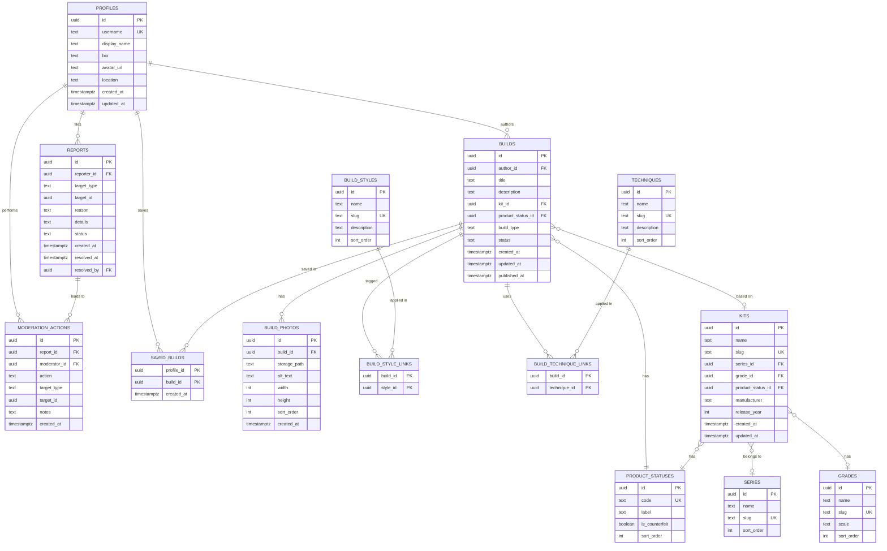

# 03 ERD and Data Dictionary

## Ringkasan (Bahasa Indonesia)

Dokumen ini mendefinisikan model data Vin untuk MVP: profil pengguna, build post, foto build, kit, series, grade/scale, gaya build, teknik, status produk, serta laporan dan catatan moderasi. Drizzle ORM menjadi sumber kebenaran skema, dan database adalah Postgres. Setiap entitas diberi tanda wajib atau opsional, relasi utama, batasan, dan indeks yang disarankan untuk pencarian serta filter. Tabel taksonomi (series, grade, gaya, teknik, status produk) sengaja dirancang untuk bertambah baris dan kolom seiring kebutuhan, tanpa membangun katalog lengkap sejak awal.

## Scope

This document covers the MVP data model and its extension points. It pairs with `02-architecture.md`.

- Schema source of truth: Drizzle ORM.
- Database: Postgres (Supabase managed for the MVP).
- Taxonomy starts small and grows. The MVP does not build an exhaustive kit catalog.
- The schema is MVP-sized and extendable. Later features such as collection tracking, commissions, or commerce are not modeled here.

## Entity relationship diagram

## Design notes

- Auth users live in Supabase Auth (`auth.users`). Vin stores app-level profile data in `profiles`, keyed by the same user id. This keeps the profile table app-owned and portable.
- `profiles` is the builder profile. Visitor accounts without published work are still valid profiles.
- `product_statuses` distinguishes official products, third-party products, and bootleg / knock-off products. The bootleg code carries `is_counterfeit = true`, which drives the counterfeit warning and the published post label.
- A build carries its own `product_status_id` because a kit reference is optional. The build's status is authoritative for the post label. The kit's status is the catalog default.
- `build_type` is a plain optional text field for the MVP, for example straight build or custom build. It can become a taxonomy table later.
- Taxonomy tables (`series`, `grades`, `build_styles`, `techniques`, `product_statuses`) hold a small seed set for the MVP. New values are added as rows. New dimensions are added as optional columns or new tables.
- Grades and scales are combined in one `grades` table for the MVP. If scales need their own identity, split a `scales` table later and leave `grades.scale` as a display value.
- `reports` and `moderation_actions` keep moderation history. `saved_builds` backs the confirmed rule that an account is required to save a build.

## Data dictionary

Legend: Required = Yes means a non-null value is expected. Types are Postgres types.

### profiles

App-owned builder profile. One row per user.

| Column | Type | Required | Notes |
| --- | --- | --- | --- |
| id | uuid | Yes | Primary key. Matches the Supabase Auth user id. |
| username | text | Yes | Unique. Used in profile URLs. |
| display_name | text | Yes | Shown name. |
| bio | text | No | Profile description. |
| avatar_url | text | No | Resolved avatar URL or storage path. |
| location | text | No | Free text. Kept simple for MVP. |
| created_at | timestamptz | Yes | Default now(). |
| updated_at | timestamptz | Yes | Updated on change. |

### builds

Structured build post.

| Column | Type | Required | Notes |
| --- | --- | --- | --- |
| id | uuid | Yes | Primary key. |
| author_id | uuid | Yes | Foreign key to `profiles.id`. |
| title | text | Yes | Post title. Searchable. |
| description | text | No | Post body. Searchable. |
| kit_id | uuid | No | Foreign key to `kits.id`. Optional because a builder may not know the kit. |
| product_status_id | uuid | Yes | Foreign key to `product_statuses.id`. Authoritative for the post label. |
| build_type | text | No | For example straight build or custom build. May become a taxonomy table. |
| status | text | Yes | One of `draft`, `published`, `hidden`, `removed`. Default `draft`. |
| created_at | timestamptz | Yes | Default now(). |
| updated_at | timestamptz | Yes | Updated on change. |
| published_at | timestamptz | No | Set when the build is first published. |

### build_photos

Photos attached to a build. Storage holds the bytes. This table holds metadata.

| Column | Type | Required | Notes |
| --- | --- | --- | --- |
| id | uuid | Yes | Primary key. |
| build_id | uuid | Yes | Foreign key to `builds.id`. |
| storage_path | text | Yes | Path in the storage bucket. |
| alt_text | text | No | Accessibility text. |
| width | int | No | Pixel width, when known. |
| height | int | No | Pixel height, when known. |
| sort_order | int | Yes | Default 0. Lowest value is the cover photo. |
| created_at | timestamptz | Yes | Default now(). |

### kits

Base kit reference. The MVP keeps a small set, not a full catalog.

| Column | Type | Required | Notes |
| --- | --- | --- | --- |
| id | uuid | Yes | Primary key. |
| name | text | Yes | Kit name. Searchable. |
| slug | text | Yes | Unique. Used in kit URLs. |
| series_id | uuid | No | Foreign key to `series.id`. |
| grade_id | uuid | No | Foreign key to `grades.id`. |
| product_status_id | uuid | Yes | Foreign key to `product_statuses.id`. Catalog default. |
| manufacturer | text | No | For example Bandai or a third-party maker. |
| release_year | int | No | Year, when known. |
| created_at | timestamptz | Yes | Default now(). |
| updated_at | timestamptz | Yes | Updated on change. |

### series

Taxonomy. Gundam series or franchise grouping.

| Column | Type | Required | Notes |
| --- | --- | --- | --- |
| id | uuid | Yes | Primary key. |
| name | text | Yes | Display name. |
| slug | text | Yes | Unique. Used in filters and URLs. |
| sort_order | int | No | Controls display order. |

### grades

Taxonomy. Gunpla grade, with an optional scale value. Designed to split later.

| Column | Type | Required | Notes |
| --- | --- | --- | --- |
| id | uuid | Yes | Primary key. |
| name | text | Yes | For example High Grade or Master Grade. |
| slug | text | Yes | Unique. Used in filters and URLs. |
| scale | text | No | For example 1/144. Display value for the MVP. |
| sort_order | int | No | Controls display order. |

### product_statuses

Taxonomy. Official, third-party, or bootleg / knock-off.

| Column | Type | Required | Notes |
| --- | --- | --- | --- |
| id | uuid | Yes | Primary key. |
| code | text | Yes | Unique. One of `official`, `third_party`, `bootleg`. |
| label | text | Yes | Display label. |
| is_counterfeit | boolean | Yes | Default false. True for `bootleg`. Drives the warning. |
| sort_order | int | No | Controls display order. |

### build_styles

Taxonomy. Visual style, for example weathered or clean.

| Column | Type | Required | Notes |
| --- | --- | --- | --- |
| id | uuid | Yes | Primary key. |
| name | text | Yes | Display name. |
| slug | text | Yes | Unique. Used in filters and URLs. |
| description | text | No | Short explanation. |
| sort_order | int | No | Controls display order. |

### techniques

Taxonomy. Method used, for example airbrushing or scribing.

| Column | Type | Required | Notes |
| --- | --- | --- | --- |
| id | uuid | Yes | Primary key. |
| name | text | Yes | Display name. |
| slug | text | Yes | Unique. Used in filters and URLs. |
| description | text | No | Short explanation. |
| sort_order | int | No | Controls display order. |

### build_style_links

Join table between builds and build styles. Many-to-many.

| Column | Type | Required | Notes |
| --- | --- | --- | --- |
| build_id | uuid | Yes | Foreign key to `builds.id`. Part of composite primary key. |
| style_id | uuid | Yes | Foreign key to `build_styles.id`. Part of composite primary key. |

### build_technique_links

Join table between builds and techniques. Many-to-many.

| Column | Type | Required | Notes |
| --- | --- | --- | --- |
| build_id | uuid | Yes | Foreign key to `builds.id`. Part of composite primary key. |
| technique_id | uuid | Yes | Foreign key to `techniques.id`. Part of composite primary key. |

### reports

Moderation reports raised against a build, profile, or photo.

| Column | Type | Required | Notes |
| --- | --- | --- | --- |
| id | uuid | Yes | Primary key. |
| reporter_id | uuid | No | Foreign key to `profiles.id`. Nullable if anonymous reporting is allowed. |
| target_type | text | Yes | One of `build`, `profile`, `photo`. |
| target_id | uuid | Yes | Id of the reported entity. |
| reason | text | Yes | Short reason code or label. |
| details | text | No | Reporter notes. |
| status | text | Yes | One of `open`, `reviewing`, `resolved`, `dismissed`. Default `open`. |
| created_at | timestamptz | Yes | Default now(). |
| resolved_at | timestamptz | No | Set when the report is closed. |
| resolved_by | uuid | No | Foreign key to `profiles.id`. Moderator who closed it. |

### moderation_actions

Moderation history linked to a report.

| Column | Type | Required | Notes |
| --- | --- | --- | --- |
| id | uuid | Yes | Primary key. |
| report_id | uuid | No | Foreign key to `reports.id`. Nullable for proactive moderation. |
| moderator_id | uuid | Yes | Foreign key to `profiles.id`. |
| action | text | Yes | For example `hide`, `remove`, `warn`, `dismiss`. |
| target_type | text | Yes | One of `build`, `profile`, `photo`. |
| target_id | uuid | Yes | Id of the affected entity. |
| notes | text | No | Internal notes. |
| created_at | timestamptz | Yes | Default now(). |

### saved_builds

Backs the confirmed rule that an account is required to save a build.

| Column | Type | Required | Notes |
| --- | --- | --- | --- |
| profile_id | uuid | Yes | Foreign key to `profiles.id`. Part of composite primary key. |
| build_id | uuid | Yes | Foreign key to `builds.id`. Part of composite primary key. |
| created_at | timestamptz | Yes | Default now(). |

## Constraints

- `profiles.username` unique.
- `profiles.id` references the Supabase Auth user id.
- `kits.slug`, `series.slug`, `grades.slug`, `build_styles.slug`, and `techniques.slug` unique.
- `product_statuses.code` unique, with a check that it is one of `official`, `third_party`, `bootleg`.
- `builds.status` check: `draft`, `published`, `hidden`, `removed`.
- `reports.status` check: `open`, `reviewing`, `resolved`, `dismissed`.
- `reports.target_type` and `moderation_actions.target_type` check: `build`, `profile`, `photo`.
- Composite primary keys on `build_style_links`, `build_technique_links`, and `saved_builds`.
- `build_photos`, `build_style_links`, `build_technique_links`, and `saved_builds` cascade on delete from `builds`.
- `builds.kit_id` and `moderation_actions.report_id` may be set to null when a referenced taxonomy row or report is removed. Deleting taxonomy rows should be blocked when in use.

## Suggested indexes for search and filters

These indexes support the MVP search and filter paths. Confirm and measure during implementation.

| Table | Index columns | Purpose |
| --- | --- | --- |
| profiles | `username` (unique) | Profile lookup by username. |
| builds | `author_id` | Builder profile and "posts by this builder". |
| builds | `status`, `published_at` desc | Published gallery ordered by recency. |
| builds | `kit_id` | Filter by base kit. |
| builds | `product_status_id` | Filter by product status and apply bootleg label. |
| builds | `created_at` desc | Default recency ordering. |
| kits | `slug` (unique) | Kit page lookup. |
| kits | `name` | Kit name prefix and equality search. |
| kits | `series_id` | Filter by series. |
| kits | `grade_id` | Filter by grade. |
| kits | `product_status_id` | Filter by product status. |
| build_photos | `build_id`, `sort_order` | Ordered photo loading per build. |
| build_style_links | `style_id` | Filter builds by style. |
| build_technique_links | `technique_id` | Filter builds by technique. |
| saved_builds | `build_id` | Count and list saves per build. |
| reports | `status`, `created_at` | Moderation queue ordering. |
| reports | `target_type`, `target_id` | All reports for one entity. |

Later, when database text search is not enough, add a full-text index on `builds.title` and `builds.description` (for example a GIN index over `to_tsvector`). A dedicated search service (Meilisearch, or Typesense as an alternative) replaces that path when usage justifies it. See `02-architecture.md`.

## Taxonomy growth

- Add values as rows in the taxonomy table. Do not add a new column for every new value.
- Add a per-taxonomy `sort_order` to control display order without hardcoding order in the app.
- Add `description` to a taxonomy table when builders need to understand a term.
- Split `grades.scale` into a `scales` table if scales need their own pages, filters, or synonyms.
- Add a `build_types` table if build type needs filters or stable labels.
- Add a `kits.status` or soft-delete flag if kit rows must be retired without breaking existing builds.
- Keep slugs stable. They are used in URLs and filters.
- Do not build an exhaustive kit catalog for the MVP. Add kits as builders need them.

## Open questions

- Will builders enter kit details themselves, or will Vin maintain a catalog? This affects how strictly `kits` rows are curated.
- Are anonymous reports allowed? This decides whether `reports.reporter_id` is nullable in practice.
- Does the MVP need a separate `scales` table immediately, or is `grades.scale` enough at launch?
- Which search text fields beyond `builds.title` and `builds.description` matter first?
- Should hidden or removed builds stay visible to their author? This affects the `builds.status` states.

## Related documents

- `documents/vin-product-overview.md`: product source of truth.
- `documents/development/02-architecture.md`: stack, adapters, and search progression.
- `documents/development/decisions/`: architecture decision records.
