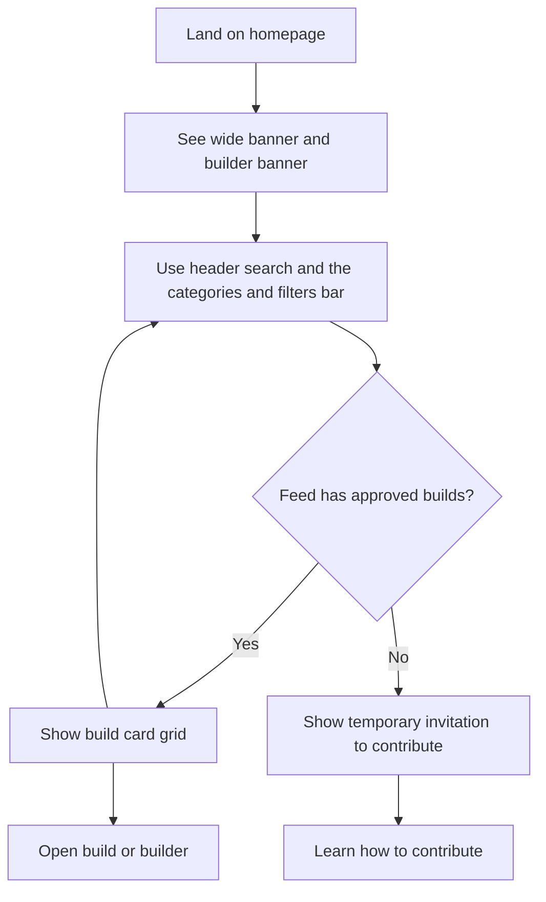
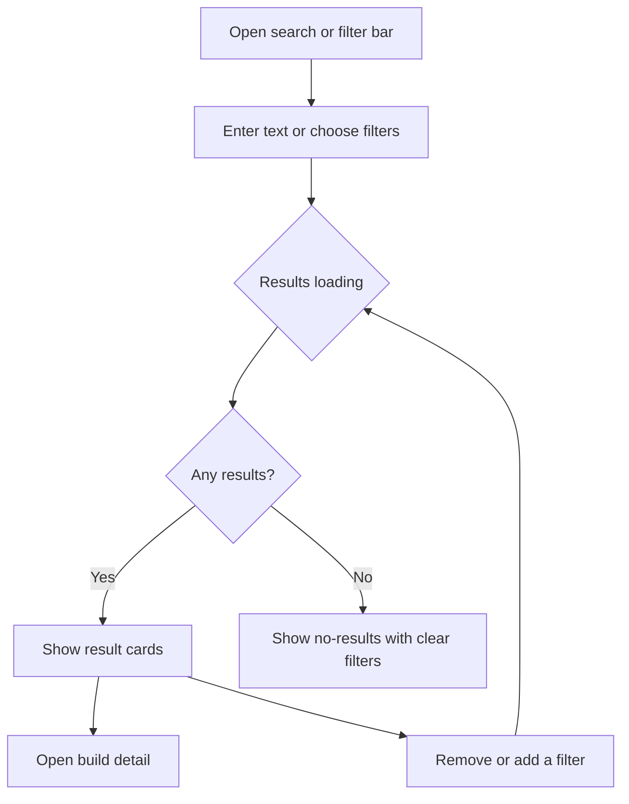
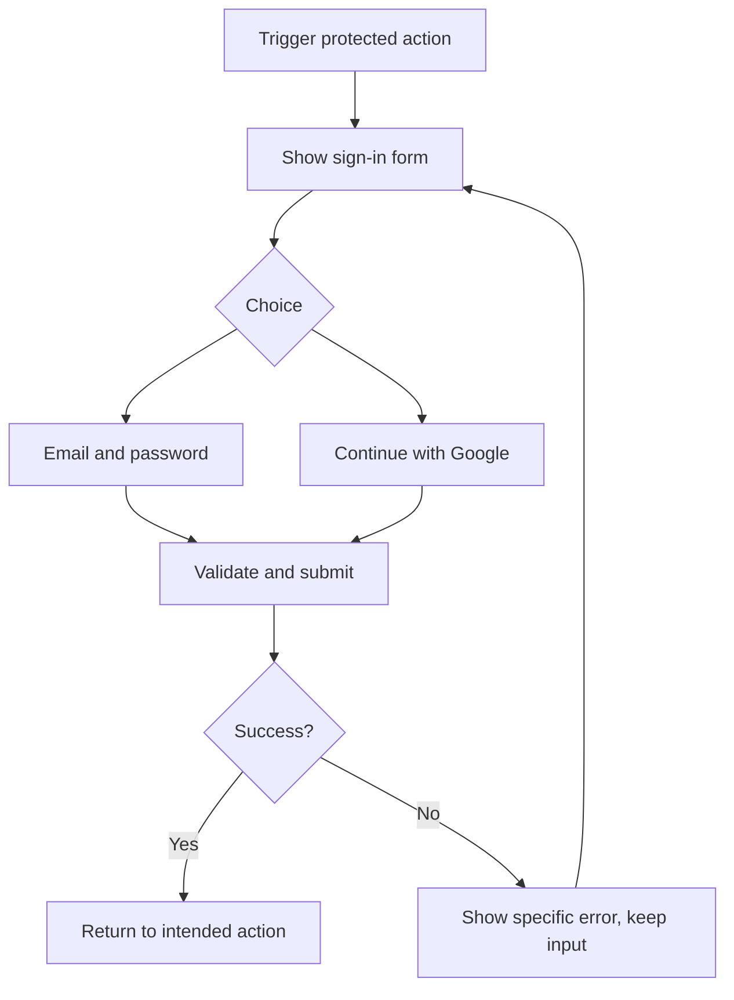
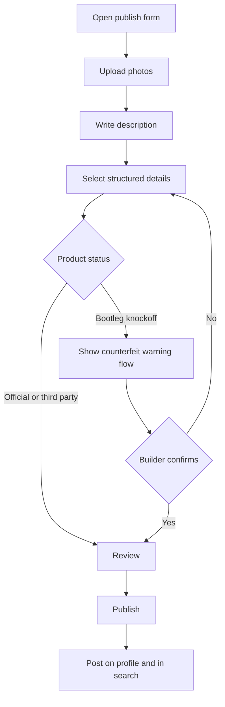
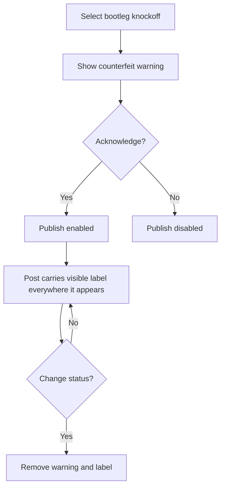
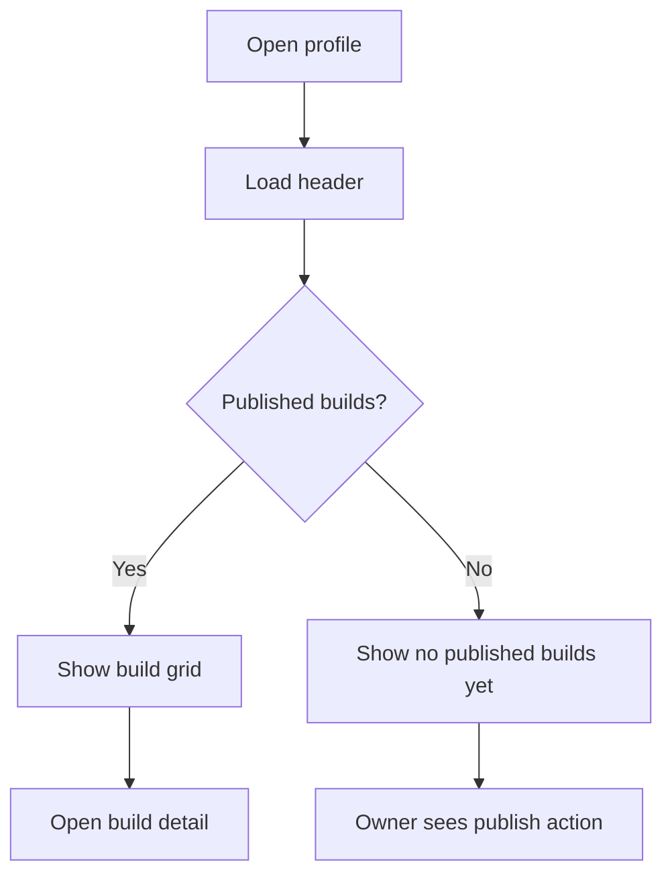
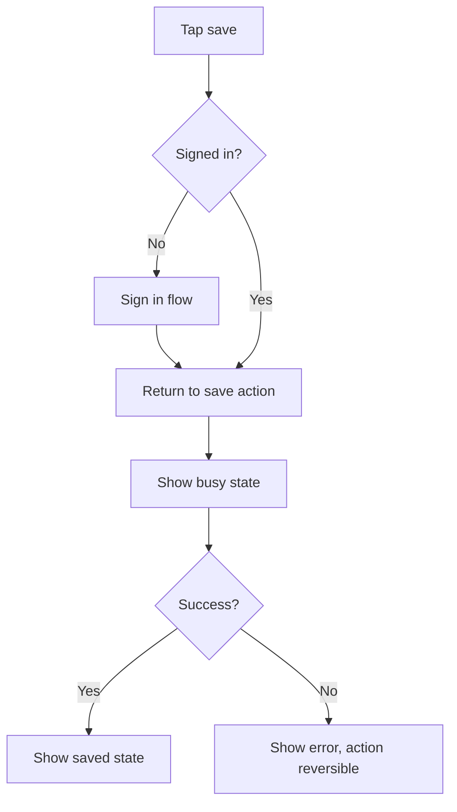

## Ringkasan (Bahasa Indonesia)

Dokumen ini menjelaskan alur UX untuk Vin versi MVP, langkah demi langkah, beserta statusnya. Alur yang dicakup: kunjungan pertama ke homepage hybrid gallery-first, jelajah dan pencarian tanpa akun, masuk dan daftar (email/password dan Google), membagikan build (unggah foto, penandaan, pemilihan bootleg dan peringatannya), melihat detail build, melihat profil builder, dan simpan/favorit.

Setiap alur mencantumkan status kosong, memuat, galat, dan sukses, plus alur peringatan bootleg/knock-off. Dokumen ini mengikuti `documents/vin-product-overview.md` dan `documents/development/04-design-system.md`. Ini adalah keputusan tingkat pengembangan; jika terjadi perbedaan, product overview yang berlaku. Perilaku yang belum diputuskan ditandai sebagai pertanyaan terbuka, bukan fitur.

## # UX Flows

## 1. How to Read This Document

Every flow lists: goal, entry points, preconditions, numbered steps, a state table (empty, loading, error, success), and edge cases. Mermaid diagrams show the primary path. This document is a development-level decision that follows `documents/vin-product-overview.md` and `documents/development/04-design-system.md`. The product overview wins on any conflict.

Confirmed product rules that every flow respects:

- Visitors browse without an account. An account is required to publish or save.
- A bootleg / knock-off selection shows a counterfeit warning and the published post carries a visible label.
- Vin does not endorse counterfeit goods.
- No fake content is shown to fill an empty surface. Empty states offer a real next step.

Terminology: build post, builder profile, kit, grade, scale, series, style, technique, product status, bootleg / knock-off, taxonomy.

## 2. Shared State Model

All data surfaces reuse the same four states from the design system:

| State | Meaning | Standard treatment |
| --- | --- | --- |
| Empty | Request succeeded, no content | Explain the surface and offer one next action. |
| Loading | Request in flight | Skeleton that matches the final layout. |
| Error | Request failed | Plain-language message, retry, and preserved user input. |
| Success | Content rendered | Normal output, including labels and warnings. |

## 3. Flow 1: First Visit (Gallery-First Hybrid Homepage)

**Goal:** a first-time visitor understands what Vin is in seconds and can immediately browse real builds.

**Entry points:** direct URL, search engine, a shared link to the homepage.

**Preconditions:** none. No account required.

**Steps:**

1. Visitor lands on the homepage.
2. A wide banner shows gallery imagery, a title, and a featured builder banner.
3. A categories and filters bar sits below the banner (Grade, Seri, Gaya, Teknik, Status, plus sort), while search stays in the header.
4. A grid of real, approved build posts renders below.
5. Visitor opens a build card or a builder, or narrows the feed with search and filters.
6. A link to the About page carries the longer product story.

**States:**

| State | Behavior |
| --- | --- |
| Empty | If there are not enough real approved builds, show the temporary introduction page that invites builders to contribute. Do not show invented work. |
| Loading | Banner and filters render immediately; the feed shows card skeletons. |
| Error | The feed shows an inline error with retry; banner, search, and filters stay usable. |
| Success | Real build cards in a responsive grid with kit, grade, and status label visible. |

**Edge cases:** slow connection (render text and search before images), zero approved builds (temporary invitation page), no JavaScript beyond what is required for search (gallery is server-rendered where possible).

## 4. Flow 2: Browse and Search Without an Account

**Goal:** a visitor finds relevant builds using text search and structured filters without signing in.

**Entry points:** homepage, a build detail page, a builder profile, a shared link.

**Preconditions:** browsing and search require no account.

**Steps:**

1. Visitor enters a kit, series, or builder name in search, or opens the filter bar.
2. Visitor applies filters: grade, scale, series, style, technique, product status.
3. Results update and show the active filters as removable chips.
4. Visitor scans results and opens a build.
5. If the visitor wants to save a build, the flow moves to sign in (Flow 3).

**States:**

| State | Behavior |
| --- | --- |
| Empty | No search yet: show popular or recent real builds, or a prompt to search. No results: "No builds match" with a clear-filters action. |
| Loading | Result count placeholder and card skeletons; search input remains editable. |
| Error | Inline error with retry; filters and query are preserved. |
| Success | Ranked result cards; active filters visible and removable. |

**Edge cases:** a filter value with zero results, a misspelled kit name, a very broad query, a filter combination that is valid but empty. In all cases the visitor can remove filters and try again without losing the query.

**Open question:** how homepage recommendations work is not approved. A proposal exists to keep search results focused, keep the homepage broad, and, if personalization is added, label a small "related to your recent search" section using a single search as a temporary signal. Recorded here as an open question, not a feature.

## 5. Flow 3: Sign In and Sign Up

**Goal:** a visitor creates an account or signs in to publish or save.

**Entry points:** a save action, a publish action, a header account action, a deep link to a protected action.

**Preconditions:** none to view. Account required only to publish or save.

**Steps:**

1. Visitor triggers a protected action (save a build, publish a post) or opens the account entry.
2. Sign-in screen offers email/password and Google.
3. New visitor switches to sign-up, or continues with Google which creates the account on first use.
4. On submit, the form validates, then submits.
5. On success, the visitor returns to the action they intended, or to a sensible default.
6. On error, the message is specific and input is preserved.

**States:**

| State | Behavior |
| --- | --- |
| Empty | Not applicable. |
| Loading | Submit button shows a busy state; fields disabled during submit. |
| Error | Field-level errors for invalid email or short password; form-level error for wrong credentials or provider failure; input preserved. |
| Success | Redirect to the intended destination with a brief confirmation. |

**Edge cases:** Google account already linked to an existing email account (define one clear rule before launch; treat as open), network failure during OAuth (return to sign-in with retry), expired session (prompt to sign in again and preserve intent).

## 6. Flow 4: Share a Build

**Goal:** a signed-in builder publishes a structured build post.

**Entry points:** a global publish action, the builder's own profile, an empty-state call to action.

**Preconditions:** signed in (Flow 3).

**Steps:**

1. Builder opens the publish form.
2. Builder uploads one or more photos. Each file shows progress, a thumbnail, and a remove action.
3. Builder writes a description.
4. Builder selects structured details: base kit, grade, scale, series, build type, style, techniques.
5. Builder selects product status. If bootleg / knock-off is chosen, the bootleg warning flow runs (Flow 5).
6. Builder reviews the post and publishes.
7. On success, the post appears on the builder profile and in relevant search results.

**States:**

| State | Behavior |
| --- | --- |
| Empty | New post has no photos and no details; the form prompts the first required field. |
| Loading | Photo upload shows per-file progress; publish button shows a busy state. |
| Error | Per-file upload errors with retry or remove; validation errors on required fields; publish error with input preserved. |
| Success | Confirmation with a link to the published post. |

**Edge cases:** very large or unsupported image files, upload dropping mid-way, publishing with no photo (define whether at least one photo is required; treat as open), losing the draft on refresh (autosave is a candidate, not committed).

## 7. Flow 5: Bootleg Warning Flow

**Goal:** the builder understands the counterfeit warning before publishing, and the published post is clearly labeled.

**Entry points:** product status selection inside Flow 4.

**Preconditions:** builder selected bootleg / knock-off.

**Steps:**

1. Builder selects bootleg / knock-off.
2. A warning banner states that the item is counterfeit and that Vin does not endorse counterfeit goods.
3. The builder must explicitly acknowledge before publishing is enabled.
4. On publish, the post carries a persistent visible label on the detail page, in gallery cards, and in search results.
5. The builder can change the status, which removes the warning and the label.

**States:**

| State | Behavior |
| --- | --- |
| Empty | Not selected: no warning shown. |
| Loading | Not applicable. |
| Error | If the label fails to attach, block publishing rather than publish unlabeled. |
| Success | Post is labeled in the detail page, gallery cards, and search results. |

**Related document:** `documents/development/06-moderation-policy.md` defines the exact warning copy, the label rule, and the reporting flow. Warning copy is authored there so there is one source.

## 8. Flow 6: View a Build Detail

**Goal:** a visitor sees the work clearly and can reach the builder and other builds.

**Entry points:** gallery card, search result, builder profile, shared link.

**Preconditions:** none.

**Steps:**

1. Visitor opens a build post.
2. Photos render with the description and structured details.
3. Product status and the bootleg / knock-off label are visible when present.
4. Builder name links to the builder profile.
5. Visitor can save the build (Flow 8) or share the link.

**States:**

| State | Behavior |
| --- | --- |
| Empty | Not applicable: a page either exists or the post is not found. |
| Loading | Skeleton for the image area, title, and details. |
| Error | Full-page error with retry and a link back to the gallery. A missing or deleted post shows a clear not-found state, not a generic error. |
| Success | Photos, description, structured details, status label, builder link, save action. |

**Edge cases:** deleted or unpublished post, post with one photo versus many (define a gallery viewer; treat exact behavior as open), very long description (collapse after a readable preview).

## 9. Flow 7: View a Builder Profile

**Goal:** a visitor understands who the builder is and sees their published work.

**Entry points:** build detail, search result, shared link.

**Preconditions:** none.

**Steps:**

1. Visitor opens a profile.
2. The profile header shows identity and published build count.
3. Published builds render in a grid.
4. Visitor opens a build or returns to browsing.
5. The owner of the profile sees edit and publish actions.

**States:**

| State | Behavior |
| --- | --- |
| Empty | "No published builds yet." The owner sees a publish action; a visitor sees a neutral message. |
| Loading | Header and grid skeletons. |
| Error | Inline error with retry. |
| Success | Profile header plus published build grid. |

**Edge cases:** profile with only bootleg / knock-off posts (labels still apply), unpublished or private drafts (not shown publicly), a builder with a very large number of posts (pagination or incremental loading; exact method is open).

## 10. Flow 8: Save / Favorite

**Goal:** a signed-in user saves a build to find it again.

**Entry points:** build card, build detail, search results.

**Preconditions:** signed in. A visitor without an account is prompted to sign in (Flow 3) and returned to the save action.

**Steps:**

1. User taps save on a build.
2. If not signed in, the sign-in flow starts and returns to the action.
3. The save action shows a busy state, then a saved confirmation.
4. User can view saved builds in one place and remove a save.

**States:**

| State | Behavior |
| --- | --- |
| Empty | Saved list has no items: explain and link back to browse. Not signed in: prompt to sign in. |
| Loading | Save button busy state; saved list shows skeletons. |
| Error | Inline error; the action is reversible and does not silently fail. |
| Success | Saved state shown; item appears in the saved list. |

**Edge cases:** saving the same build twice (idempotent), removing a save from the saved list, saving while offline (queue or explain clearly; exact behavior is open).

## 11. Cross-Flow State Coverage Matrix

| Flow | Empty | Loading | Error | Success |
| --- | --- | --- | --- | --- |
| First visit | Yes (temporary invitation page) | Yes (gallery skeletons) | Yes (inline retry) | Yes |
| Browse and search | Yes (no query, no results) | Yes | Yes | Yes |
| Sign in / sign up | N/A | Yes | Yes | Yes |
| Share a build | Yes (new form) | Yes (uploads, submit) | Yes (per-file, per-field, publish) | Yes |
| Bootleg warning | Yes (not selected) | N/A | Yes (block unlabeled publish) | Yes |
| View build detail | N/A | Yes | Yes (including not-found) | Yes |
| View builder profile | Yes | Yes | Yes | Yes |
| Save / favorite | Yes (empty list, signed out) | Yes | Yes | Yes |

## 12. Open Questions

- Whether at least one photo is required to publish.
- Draft autosave behavior.
- Photo gallery viewer behavior for many photos.
- Pagination versus incremental loading on large profiles and result sets.
- Save-while-offline behavior.
- Google account linking rule when an email account already exists.
- Homepage recommendation behavior (proposal noted in Flow 2, not approved).
- Publish is shown at the moment the shared post becomes visible.

## 13. Related Documents

- `documents/vin-product-overview.md` (source of truth)
- `documents/development/04-design-system.md`
- `documents/development/06-moderation-policy.md`
- `documents/development/03-erd.md`
