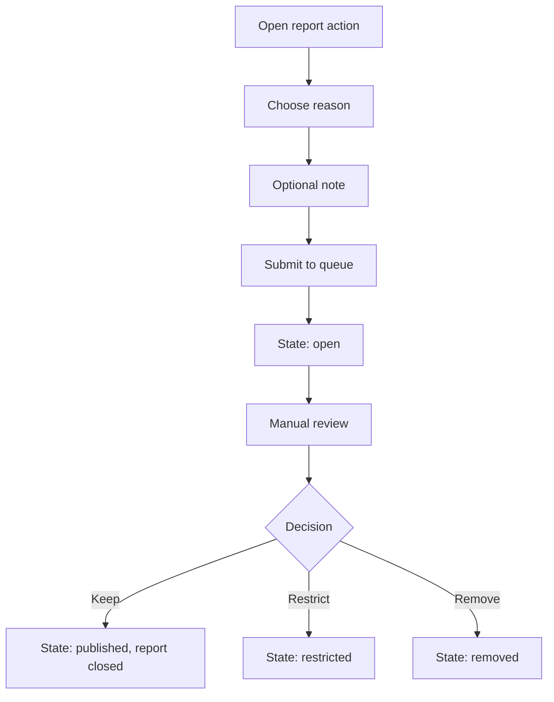
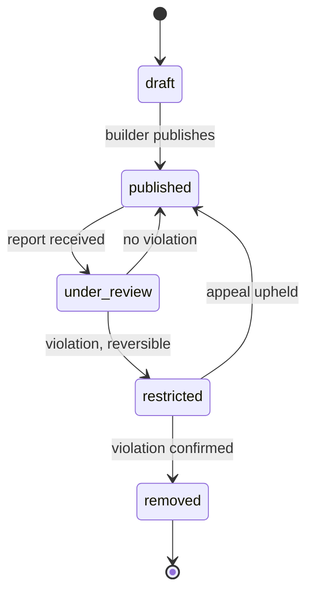

## Ringkasan (Bahasa Indonesia)

Dokumen ini menetapkan kebijakan moderasi Vin versi MVP. Isinya: aturan pelabelan bootleg / knock-off beserta teks peringatan wajib, kewajiban label pada kiriman yang sudah terbit, pernyataan bahwa Vin tidak mendukung barang tiruan, alur pelaporan dan penurunan konten (takedown) dengan tinjauan manual, kategori konten yang dilarang, perbedaan antara berbagi dan menjual (aturan jual beli ditunda), serta status moderasi dan jejak audit.

Kebijakan ini mengikuti `documents/vin-product-overview.md`. Jika terjadi perbedaan, product overview yang berlaku. Teks peringatan di bawah adalah draf yang perlu persetujuan pemilik produk dan ditandai `[OWNER REVIEW]`. Tinjauan manual dapat diterima untuk MVP. Dokumen ini sengaja dijaga kecil; aturan jual beli, banding otomatis, dan moderasi skala besar bukan bagian dari MVP.

## # Moderation Policy

## 1. Scope and Status

This policy covers user-generated build posts and builder profiles for the MVP. It follows `documents/vin-product-overview.md`. The product overview wins on any conflict. This is a development-level decision.

Confirmed product rules this policy implements:

- Bootleg / knock-off posts are allowed, but the builder must select a bootleg / knock-off option and see a warning that the item is counterfeit.
- The published post carries a clear label.
- Vin does not endorse counterfeit goods.
- Selling rules are a separate, deferred decision.
- MVP moderation may be manual.

MVP-sized boundary: manual review, one reporting path, a small prohibited list, and a simple audit record. No automated enforcement, no appeals product, and no marketplace rules in the MVP.

## 2. Moderation Principles

1. **Label, do not hide.** Reason: a confirmed product rule allows bootleg / knock-off sharing with a visible label instead of removal.
2. **Truthful product status.** Reason: visitors must be able to tell official, third-party, and counterfeit items apart.
3. **Manual first, automate later.** Reason: volume is low at launch and judgment matters more than speed.
4. **Every action is recorded.** Reason: trust and consistency need a traceable decision history.
5. **Least intrusive remedy.** Reason: prefer a label or a restricted view before permanent removal.
6. **No fabricated enforcement numbers.** Reason: reporting and outcome statistics are `[REAL DATA]` only, and are not published until real.

## 3. Bootleg / Knock-off Labeling Rule

**Rule.** A builder may publish a bootleg / knock-off build only after selecting product status = bootleg / knock-off and explicitly acknowledging the warning. The published post then carries a persistent visible label wherever it appears: the build detail page, gallery cards, and search results.

**Required warning copy.** The following is the candidate wording for the MVP. It is not final and is marked `[OWNER REVIEW]`. It must be approved, and localized, before launch.

Authoring warning banner (Indonesian):

> Peringatan: kamu menandai build ini sebagai bootleg / knock-off. Item ini adalah barang tiruan (counterfeit). Vin tidak mendukung barang tiruan. Kiriman ini akan diberi label yang terlihat oleh publik.

Authoring warning banner (English):

> Warning: you marked this build as bootleg / knock-off. This item is counterfeit. Vin does not endorse counterfeit goods. This post will carry a visible public label.

Acknowledgement control (Indonesian):

> Saya mengerti item ini barang tiruan dan kiriman ini akan diberi label.

Acknowledgement control (English):

> I understand this item is counterfeit and this post will be labeled.

Published post label (Indonesian):

> Bootleg / knock-off: barang tiruan. Vin tidak mendukung barang tiruan.

Published post label (English):

> Bootleg / knock-off: counterfeit item. Vin does not endorse counterfeit goods.

Rules for the copy:

- The label must remain visible without hover or expansion and must not rely on color alone.
- Publish is disabled until the acknowledgement is checked.
- Changing product status away from bootleg / knock-off removes the label.
- If the label cannot be attached, block publishing rather than publish unlabeled.

## 4. Published Post Labels

Every published post shows its product status: official product, third-party product, or bootleg / knock-off. Reason: product status is a confirmed structured field and drives trust.

| Product status | Label shown | Reason |
| --- | --- | --- |
| Official product | "Official product" | Confirms the item is an official release. |
| Third-party product | "Third-party product" | Distinguishes legitimate third-party items from counterfeit ones. |
| Bootleg / knock-off | "Bootleg / knock-off: counterfeit item. Vin does not endorse counterfeit goods." | Required by the confirmed product rule. |

Labels are text plus an icon, never color alone, so they survive color blindness and low-quality screens.

## 5. Vin Does Not Endorse Counterfeit Goods

This statement appears in the warning, on the published label, in the policy page, and in any future marketplace rules. Reason: it separates allowing a user to document a build from endorsing or enabling counterfeiting.

No part of the MVP sells goods, processes payments, or brokers transactions. Do not present selling as available.

## 6. Prohibited Content Categories

The MVP list is intentionally short. Each category has one reason. Enforcement is manual.

| Category | Reason |
| --- | --- |
| Counterfeit goods misrepresented as official or third-party. | Product status must be truthful; mislabeling defeats the labeling rule. |
| Illegal goods or stolen items. | Unlawful content is out of scope. |
| Sexual content involving minors, and explicit sexual content. | Protects people and keeps the platform safe. |
| Harassment, hate speech, or credible threats. | Protects community members. |
| Personal data or doxxing. | Protects privacy. |
| Spam, scams, fraud, or phishing. | Protects visitors from harm. |
| Malware or malicious links. | Protects devices and accounts. |
| Copyright or trademark infringement beyond a disclosed bootleg label, including reusing another person's photos without permission. | Protects creators' work. |
| Content that promotes the sale of counterfeit goods. | Selling rules are deferred and counterfeit sales are not permitted. |

This list is a starting point, not a claim to cover every case. Moderation decisions on unlisted content follow the principles in Section 2 and are recorded.

## 7. Reporting Flow (MVP)

Any visitor, signed in or not, can report a build post or a builder profile. Manual review is acceptable for the MVP.

**Steps:**

1. Reporter opens a report action on the post or profile.
2. Reporter chooses a reason from the prohibited categories (and one "other" with a free-text note).
3. Optional note is added.
4. Report is submitted to a review queue with the state `open`.
5. A moderator reviews the item against this policy.
6. Moderator records a decision and a reason, which moves the item to a moderation state (Section 10).
7. Reporter is not promised a specific outcome or timeline in the MVP.

**States:**

| State | Behavior |
| --- | --- |
| Empty | No reports: the queue is empty, which is a normal state. |
| Loading | Report submit shows a busy state. |
| Error | Report submit failure is shown and the report can be retried; input is preserved. |
| Success | Confirmation that the report was received. |

**Abuse guard:** repeated false or spam reports are themselves a moderation concern. Exact limits are an open question, not committed.

## 8. Takedown Flow (MVP)

1. A moderator decides a post violates policy.
2. The post moves to `restricted` (hidden from public view, retained for review) or `removed` (hidden and scheduled for deletion), depending on severity.
3. The author is notified with the reason and the relevant policy category.
4. The author may reply to the notice to request a human re-check.
5. A second moderator reviews the appeal if one is raised. In the MVP this may be the same small team, but the decision is recorded.

Reason: restricting first preserves evidence and allows reversal, which is safer than an irreversible delete for a low-volume MVP.

## 9. Sharing Versus Selling

Sharing and selling are different. This distinction is a policy boundary, not a feature announcement.

| Action | MVP status | Rule |
| --- | --- | --- |
| Share a build post, including a bootleg / knock-off build | Allowed | Must use the bootleg / knock-off label and warning. |
| Offer a build, kit, or part for sale | Not available in the MVP | Selling is deferred. Do not present it as available. |
| Sell counterfeit goods | Not permitted | Any future marketplace must define its own rules, and counterfeit sales remain prohibited. |

Reason: allowing a builder to document a bootleg build does not grant permission to sell counterfeit goods. Selling rules are a separate, deferred decision per the product overview.

## 10. Moderation States and Audit Trail

A build post (and a profile) has a moderation state separate from its publish state. Reason: an item can be published and still be under review.

| State | Publicly visible | Meaning |
| --- | --- | --- |
| `draft` | No | Author is still composing. |
| `published` | Yes | Live and passing policy. |
| `under_review` | Yes, until a decision | A report is open and a moderator is reviewing. |
| `restricted` | No | Hidden pending a final decision or appeal. |
| `removed` | No | Violation confirmed; scheduled for deletion. |

**Audit trail.** Every moderation action records:

- Item identifier and type (build post or builder profile).
- Actor (moderator account).
- Timestamp.
- Previous state and new state.
- Decision reason and the policy category.
- Related report identifier, when present.

Records are retained so decisions can be reviewed and repeated consistently. Retention period and storage location are open questions.

## 11. MVP Scope and Deferred Items

**In the MVP:**

- Bootleg / knock-off labeling with required warning and acknowledgement.
- Visible product status labels.
- One report path with manual review.
- A small prohibited content list.
- A moderation state machine and an audit trail.

**Deferred (not in the MVP):**

- Automated detection or enforcement.
- An appeals product with a formal workflow.
- Reporter outcome notifications and timelines.
- Marketplace and selling rules.
- Published moderation statistics. These are `[REAL DATA]` only and appear as "Coming soon" until real.
- Volume-based rate limits and anti-abuse automation.

## 12. Open Questions

- Owner approval and final wording of the warning copy in Section 3.
- Launch languages for the warning and label.
- Who performs moderation, and what the response expectation is.
- Audit trail retention period and storage location.
- Whether a restricted post can be appealed more than once.
- How future recommendation surfaces treat bootleg / knock-off posts. This is open in the product overview and is not resolved here.
- How a future marketplace would handle product status, prohibited listings, and disputes.

## 13. Related Documents

- `documents/vin-product-overview.md` (source of truth)
- `documents/development/04-design-system.md` (warning banner and label components)
- `documents/development/05-ux-flows.md` (bootleg warning flow, reporting entry points)
- `documents/development/03-erd.md` (reports and moderation entities)
