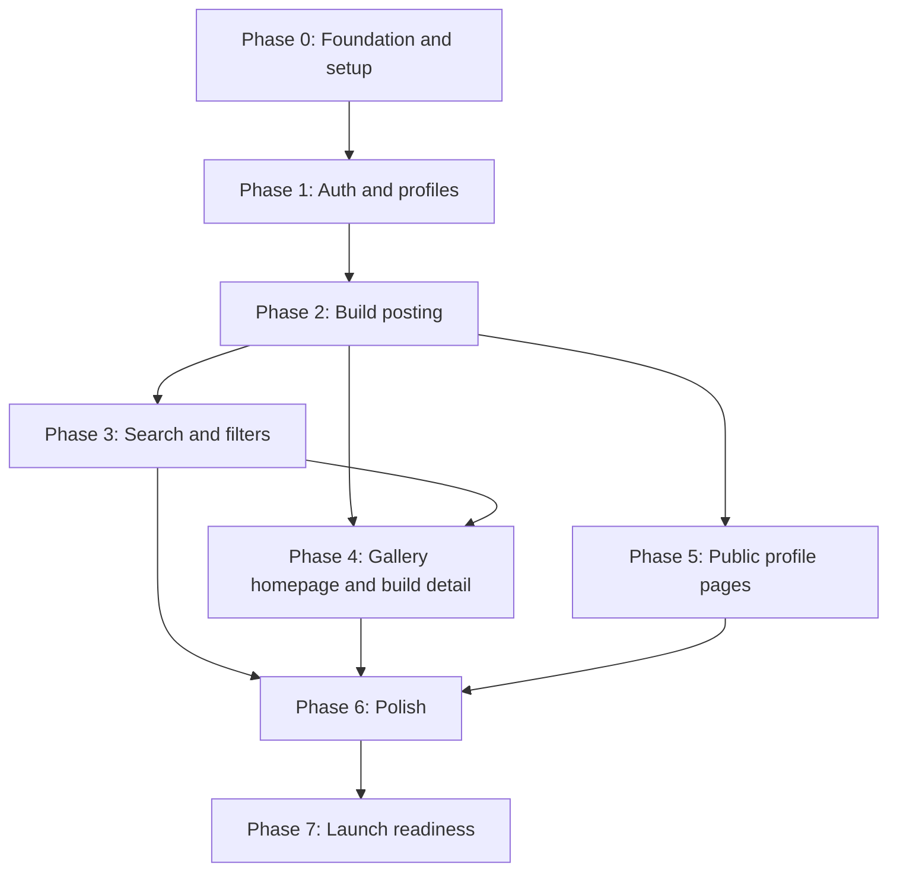

## Ringkasan (Bahasa Indonesia)

Roadmap ini memecah pekerjaan menjadi fase berbasis milestone tanpa tanggal. Setiap fase mencantumkan tujuan, deliverable utama, dan exit criteria, serta mencatat ketergantungan antar fase. Fase mencakup fondasi dan penyiapan, autentikasi dan profil, posting build, pencarian dan filter, beranda galeri dan detail build, halaman profil publik, polish, dan kesiapan peluncuran.

Roadmap ini merujuk ke [`vin-product-overview.md`](../vin-product-overview.md) dan [`01-prd.md`](01-prd.md). Fitur di luar MVP adalah usulan masa depan dan tidak disajikan sebagai fitur yang sudah tersedia. Tidak ada tanggal atau estimasi angka yang diciptakan di dokumen ini.

---

# Vin Roadmap

Status: Development document.
Source of truth: [`vin-product-overview.md`](../vin-product-overview.md).
Requirements: [`01-prd.md`](01-prd.md).

## How to read this roadmap

- The plan is milestone-based. Phases describe sequence and readiness, not dates.
- Each phase has a goal, key deliverables, and exit criteria.
- Exit criteria are the gate to the next phase. A phase is not done because work was attempted; it is done when the criteria are met.
- Dependencies between phases are called out per phase and shown in the graph below.
- Scope traces to the PRD. Later phases are planned, not available.
- No phase promises a marketplace, commissions, payments, image recognition, collection tracking, inventory, or a full encyclopedia. Those remain outside the MVP.

## Dependency overview

Reading the graph:

- Everything depends on Phase 0.
- Phase 2 needs a builder identity from Phase 1.
- Phase 3 needs structured posts from Phase 2.
- Phase 4 needs published posts (Phase 2) and can use search (Phase 3). Static rendering of known posts can start while search is in progress.
- Phase 5 needs posts to list (Phase 2) and profile data (Phase 1).
- Phase 6 polishes the surfaces built in Phases 2 to 5.
- Phase 7 verifies the whole product against the launch checklist.

## Phase 0: Foundation and setup

Goal: establish the repository, application, backend, and documentation baseline so feature work can start.

Key deliverables:

- Confirm the monorepo structure: Bun and Turborepo, with `apps/*` and `packages/*`.
- `apps/web` runs with Next.js App Router, React 19, and TypeScript.
- Provision the Supabase project for the MVP (Postgres, Auth, Storage).
- Make the Drizzle ORM schema the single source of truth for the database, with a working migration workflow.
- Isolate Supabase Auth and Storage calls behind small adapter modules as a portability guardrail.
- Environment configuration and secret handling for local and deployed environments.
- Continuous checks: type-check, lint, and build.
- Agree the first taxonomy field list, required versus optional fields, and controlled values, then record it for the ERD.
- Baseline documents in place: PRD, architecture, ERD, design system, UX flows, moderation policy, and this roadmap, with a documentation index.

Exit criteria:

- The app builds and runs locally and in the target deploy environment.
- A migration creates the initial schema, and the schema is version controlled.
- Auth and Storage are reached through adapter modules; swapping the provider does not require changing call sites.
- The first taxonomy is recorded as a draft schema with agreed required and optional fields.
- The documentation index exists and its links resolve.
- Type-check, lint, and build pass in continuous checks.

Dependencies: none. This phase is a prerequisite for every other phase.

## Phase 1: Auth and profiles

Goal: accounts exist, and a builder can create and edit a profile.

Key deliverables:

- Email/password sign-up and sign-in.
- Google sign-in.
- Sign out and session handling.
- Profile creation and editing: display name, avatar, and short bio. The exact profile fields remain open and are recorded as a development-level decision when agreed.
- Profile data stored per the schema, read from the database rather than fixtures.
- Auth handled through the Supabase Auth adapter.

Exit criteria:

- A user can sign up with email/password, sign up with Google, sign out, and sign back in.
- A signed-in user can create and edit a profile, and the changes persist.
- Authoring routes require a session.
- An unauthenticated request to a protected route is redirected or prompted to sign in.
- No hardcoded or fixture profile data is used on real pages.

Note: this phase covers the private profile surface (identity and authoring). The public builder profile page is Phase 5.

Dependencies: Phase 0.

## Phase 2: Build posting (photos, tags, bootleg warning)

Goal: a signed-in builder can publish a structured build post.

Key deliverables:

- Build post creation and editing with one or more photos and a description.
- Photo upload through the Storage adapter, with multiple photos and basic ordering.
- Structured fields from the first taxonomy (base kit, grade, scale, series, build type, style, techniques, product status).
- Bootleg / knock-off selection opens a counterfeit warning, requires acknowledgment, and adds a label to the published post.
- Inline validation for missing required fields and invalid input.
- A stable, shareable public URL per published post.
- The post appears on the builder profile and is eligible for search.

Exit criteria:

- A signed-in user can create a build post with at least one photo and a description.
- Selecting bootleg / knock-off shows the counterfeit warning, and the published post carries the bootleg / knock-off label.
- Required structured fields are enforced, and invalid input shows inline errors.
- A published post has a stable URL and stores its photos and structured values.
- A user who is not the owner cannot edit or delete the post.
- Photos and edits persist after reload.

Dependencies: Phase 0, Phase 1 (a post needs a builder identity).

## Phase 3: Search and filters

Goal: visitors can find builds by text and structured filters.

Key deliverables:

- Text search over the build description and structured values.
- Filters over the first taxonomy, for example grade, style, technique, and product status.
- Combined query and filters.
- URL-serializable filter state so results can be shared and reopened.
- Empty, loading, and error states for search.
- Search starts with database search and structured filters. A dedicated search service is a deferred option, added only when real usage justifies it, and is not required in this phase.

Exit criteria:

- A visitor can search by text without an account.
- Filters narrow results, and filters can be cleared.
- The active query and filters are reflected in the URL and can be reopened.
- Empty results show a clear empty state.
- Loading and error states are implemented.
- Search returns expected posts for a small set of known structured values in a test dataset.

Dependencies: Phase 2 (search needs structured posts).

## Phase 4: Gallery homepage and build detail

Goal: a public gallery-first homepage and a complete build detail page.

Key deliverables:

- Homepage with a concise introduction, search, a small filter set, and a gallery of real build posts.
- Gallery cards link to the build detail and the builder profile.
- Build detail page with photos, description, structured details, the bootleg / knock-off label when applicable, a link to the builder profile, and a save action.
- Share and indexing metadata on build pages.
- A separate About page for the full product story.

Exit criteria:

- The homepage renders real approved builds. No invented or unapproved work is shown.
- If there is not enough content for a useful gallery, a temporary introduction page invites builders to contribute instead of showing fake posts.
- A visitor can move from the homepage to a build to the builder profile without an account.
- Build detail shows all published photos, the description, the structured fields, and the bootleg / knock-off label when applicable.
- Build pages expose share and indexing metadata.
- A signed-in user can save a build; a visitor is prompted to sign in to save.

Dependencies: Phase 2 (published posts). Search integration depends on Phase 3, though static rendering of known posts can start before search is complete.

## Phase 5: Public profile pages

Goal: a public builder profile gathers identity and published builds.

Key deliverables:

- A public profile route.
- A profile header with identity and short bio.
- A list or grid of the builder's published builds.
- Navigation from a build detail to the profile and from the profile back to builds.

Exit criteria:

- Each builder has a public profile page.
- The profile lists the builder's published build posts.
- Every listed item opens a valid build detail page.
- Build detail links to the profile, and the profile links to builds.
- Only published builds appear. Private or removed posts are not listed.
- The profile shows no invented or unapproved content.

Dependencies: Phase 1 (profile identity) and Phase 2 (posts to list).

## Phase 6: Polish (empty/loading/error, accessibility, mobile)

Goal: consistent quality across states, accessibility, and mobile before launch.

Key deliverables:

- Empty, loading, and error states on every primary surface: gallery, search, build detail, profile, and authoring.
- Accessibility: WCAG AA contrast, keyboard navigation, visible focus, form labels, and image alt text.
- Mobile-first layouts, comfortable tap targets, and responsive images.
- A consistent components and tokens approach. Final color and type direction is an owner decision that is still open and is not fixed in this phase.
- Basic performance work: image optimization and lazy loading.

Exit criteria:

- Every primary surface has empty, loading, and error states.
- Keyboard-only navigation works for the main flows: browse, search, open build, open profile, sign up, and publish.
- Focus is visible, images have alt text, and forms have labels.
- Primary flows work on a small mobile viewport.
- Automated accessibility checks pass on the main pages, with the tool noted in the results.
- No severe contrast failures remain in the implemented theme.
- Images do not block initial load on the main pages.

Dependencies: Phases 2, 3, 4, and 5.

## Phase 7: Launch readiness

Goal: verify Vin is ready for real public use in Indonesia.

Launch checklist:

- [ ] Content: enough real approved builds to make the gallery useful. If not, the temporary introduction page is live. No fake content anywhere.
- [ ] Policy: the bootleg / knock-off warning and label are verified end to end from selection to published page.
- [ ] Policy: the moderation policy is documented, and a reporting path works if in scope.
- [ ] Policy: selling rules are explicitly deferred and the MVP does not imply selling counterfeit goods is allowed.
- [ ] Auth: email/password and Google sign-in are tested, and an account recovery or support path is defined.
- [ ] Search: text and filters are verified with real data, including empty, loading, and error states.
- [ ] Pages: homepage, build detail, public profile, and About are verified, with working metadata.
- [ ] Accessibility: keyboard, focus, contrast, and alt text are verified on the main flows.
- [ ] Mobile: primary flows are verified on a small viewport.
- [ ] Performance: image handling and initial load are reviewed, with no blocking regressions.
- [ ] Security: secrets, database access rules, storage permissions, and access policies are reviewed.
- [ ] Observability: error tracking and basic usage signals are instrumented, with no invented targets.
- [ ] Legal/operational: terms, privacy, the counterfeit policy, and a takedown path are reviewed with the owner.
- [ ] Launch community: the first communities are identified and an outreach plan is agreed (resolves an open question).
- [ ] Language: launch language support is decided (resolves an open question).
- [ ] Rollback and support: a deploy rollback path and a support contact are defined.

Exit criteria:

- Every checklist item is either complete or explicitly deferred with a named owner.
- An end-to-end smoke test passes on the production configuration: browse, search, open a build, open a profile, sign up, publish a build, select bootleg / knock-off, and see the warning and label.
- The open questions that block launch (design direction, language, launch communities, and taxonomy data ownership) have recorded decisions.

Dependencies: Phases 0 through 6.

## Beyond launch

These are future directions from the product overview, not commitments and not available at launch. They should be considered only when real usage shows a repeated need, the underlying data can be maintained, and the team can support the trust, moderation, and operational work:

- A kit identification request board, before any automated image recognition.
- A dedicated search service if database search is no longer enough.
- Broader kit discovery beyond Gunpla.
- Builder services and commissions, only with a plan for trust, responsibilities, and support.
- Buying and selling, with its own rules for product status, prohibited listings, shipping, damage, and disputes.
- A personal collection and workshop view.
- Expansion beyond Indonesia, including language, local kit data, currency, payment, and shipping.

Each of these stays out of the MVP. None is presented as available until it is designed and built.

## Change control

- The product overview wins over this roadmap when they disagree.
- New work is added to a phase only if it serves an MVP capability in the PRD. Otherwise it is recorded in "Beyond launch" or as an open question.
- When an open question is resolved, the decision is recorded in the PRD or an ADR, and this roadmap is updated to match.
